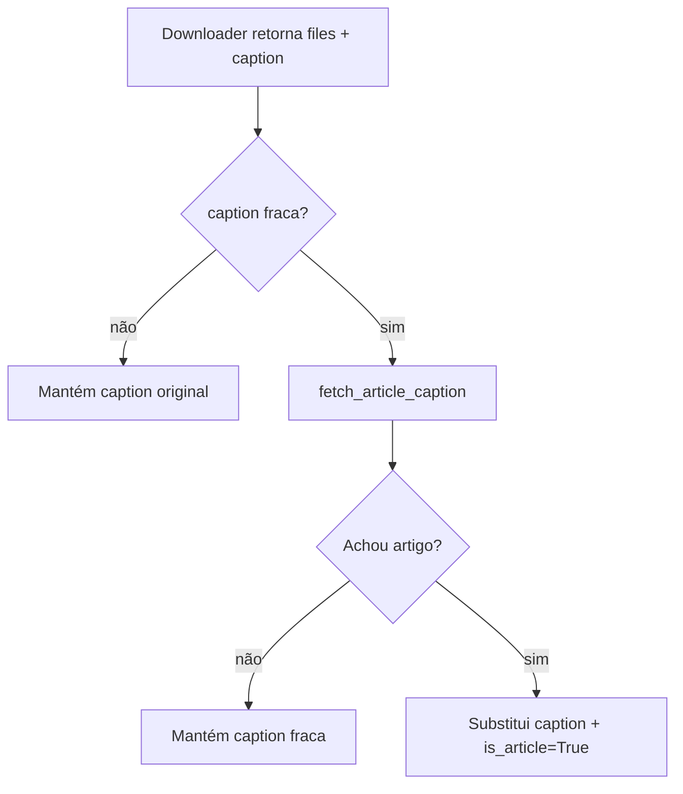

# Extração de artigo

Quando o scraper encontra HTML de notícia/blog/artigo, extrai o corpo via **trafilatura** e oferece como caption do envio.

Trafilatura é o lib state-of-art pra extração de artigo (mesmo usado por Pocket, Instapaper, modo leitor do Firefox). Suporta multi-idioma e detecta automaticamente artigo vs página de listagem/categoria.

## Quando dispara

Em **dois caminhos**:

### 1. Dentro do `scrape_fallback`

Quando o scraper genérico baixa HTML, passa pro `extract_article(html, url)` automaticamente. Se o resultado tem >= `SCRAPE_ARTICLE_MIN_CHARS` (default 300), vira a caption do envio.

### 2. Enrichment pós-download

Quando qualquer downloader (Threads, X, IG, etc.) retorna sem caption ou com caption fraca (só link), o dispatcher chama `fetch_article_caption(url)`:

1. Faz fetch com paywall bypass
2. Extrai artigo via trafilatura
3. Se >= min_chars, usa como caption
4. Marca `is_article=True` pra o handler usar `ASK_ARTICLE_TIMEOUT/DEFAULT` específicos



`_caption_is_weak(caption)` retorna True quando caption é vazia ou contém apenas o link original (sem título nem body).

## Formato

`extract_article` retorna `(title, body)`. O bot constrói a caption via `_build_caption({'title': title, 'description': body}, url)` — mesmo formato dos outros downloaders:

```
📄 Título do artigo (em bold)

Corpo do artigo aqui, várias frases, parágrafos...

🔗 Link Original
```

Truncação automática pra 1024 chars (limite do Telegram) com "..." no fim.

## Prompt

Por default, o bot **pergunta** se você quer incluir o artigo como caption:

```
📝 Descrição encontrada!
Deseja incluir como legenda?

Você tem 5s para escolher ou enviarei automaticamente.
```

**Diferença vs caption normal:**

| Tipo | Timeout default | Default no timeout |
|---|---|---|
| Caption (Twitter/IG/etc.) | `ASK_CAPTION_TIMEOUT=5.0` | `ASK_CAPTION_DEFAULT=no` |
| Artigo extraído | `ASK_ARTICLE_TIMEOUT=5.0` | `ASK_ARTICLE_DEFAULT=yes` |

A motivação pro default `yes` em artigo é que texto longo de notícia geralmente é o que o usuário quer ler — então enviar por default faz mais sentido que descartar.

## Customização

| Chave | Default | Descrição |
|---|---|---|
| `SCRAPE_ARTICLE_EXTRACT` | `"yes"` | Liga/desliga toda a feature |
| `SCRAPE_ARTICLE_MIN_CHARS` | `300` | Min chars pra considerar artigo |
| `ASK_ARTICLE_TIMEOUT` | `5.0` | Tempo (s) pra responder ao prompt |
| `ASK_ARTICLE_DEFAULT` | `"yes"` | Comportamento no timeout |

## Falsos positivos / negativos

**Falso positivo**: trafilatura extrai algo que não é artigo de verdade (lista de produtos, FAQ, etc.) e oferece como caption. Usuário diz "não" no prompt — fim do problema.

**Falso negativo**: artigo legítimo mas curto (< 300 chars) é ignorado. Diminua `SCRAPE_ARTICLE_MIN_CHARS` pra 100-150 se quiser mais agressivo.

## Logs

```
📰 Artigo detectado (1850 chars body, caption 1024 chars) em https://nytimes.com/...
```

Mostra tamanho do body extraído e da caption final pós-`_build_caption`.
