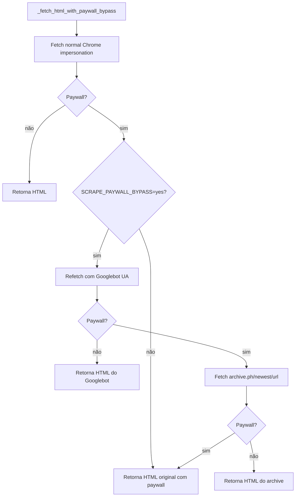

# Bypass de paywall

Paywalls "soft" (NYT, Folha, FT, Estadão, WaPo, etc.) servem o artigo inteiro pro Googlebot indexar. O MediaRaven explora isso.

!!! warning "Soft vs Hard paywall"
    - **Soft** (cobre via CSS/JS, conteúdo está no HTML): bypass funciona. ~70% dos jornalões.
    - **Hard** (Substack pago, Patreon, login real): conteúdo nem sai do servidor. **Não tem bypass.**

## A cascata



## Detecção de paywall

`_looks_like_paywall(html)` usa heurística por substring:

```python
_PAYWALL_PATTERNS = (
    'sign in to continue', 'log in to continue', 'subscribe to read',
    'create a free account to read', 'this content is for subscribers',
    'faça login para continuar', 'assine para ler',
    'conteúdo exclusivo para assinantes',
)
```

Não é perfeito — falsos negativos quando o texto da paywall é dinâmico, falsos positivos em páginas que mencionam "subscribe to read" em outro contexto. Custo do FN é o paywall passar; custo do FP é tentar bypass desnecessariamente.

## Tier 1 — Googlebot UA refetch

Se paywall detectado, refetcha com:

```python
User-Agent: Mozilla/5.0 (compatible; Googlebot/2.1; +http://www.google.com/bot.html)
```

Publishers servem o artigo completo pro Google indexar pra SEO. Se o servidor checar IP (raro), bloqueia. Se só checa UA (comum), passa.

Funciona em: NYT, Folha, Estadão, WaPo, FT, Bloomberg, WSJ (parcial), Forbes, etc.

## Tier 2 — archive.ph fallback

Se Googlebot ainda toma paywall:

```python
archive_url = f"https://archive.ph/newest/{quote(original_url)}"
```

archive.ph é um arquivo público que snapshot-ta a página. Usuários submeteram a maioria dos jornalões nos últimos 10 anos. `/newest/` retorna a versão mais recente.

Limitação: só funciona se já existe snapshot. Pra artigo recém-publicado pode não ter.

## Quando bypass não passa

Retorna `(html_original, "normal")`. O scraper continua o fluxo normal — pode ser que o `og:image` ainda apareça (paywall só bloqueia o texto). Se também não acha mídia, cai no Tier 4 (screenshot prompt).

## Combo: paywall bypass + article extraction

Quando bypass passa, o HTML retornado tem o artigo inteiro. O `extract_article` (trafilatura) extrai o corpo e oferece como **caption** do envio. Pra jornal sem mídia (só texto), o usuário recebe o artigo inteiro como mensagem do Telegram.

Detalhes em [Extração de artigo](article-extraction.md).

## Customização

| Chave | Default | Comportamento |
|---|---|---|
| `SCRAPE_PAYWALL_BYPASS` | `"yes"` | `"no"` desliga toda a cascata, respeita o bloqueio original |
| `SCRAPE_ARCHIVE_TIMEOUT_S` | `15` | Timeout do fetch do archive.ph |

## Logs

```
🔒 Paywall detectado em X — tentando Googlebot UA.
✅ Googlebot UA passou do paywall em X
📚 Tentando archive.ph para: X
✅ archive.ph retornou conteúdo para X
❌ Paywall não vencido para X
```

Útil pra debug: `LOG_LEVEL=DEBUG` mostra também os HTTP statuses intermediários.
