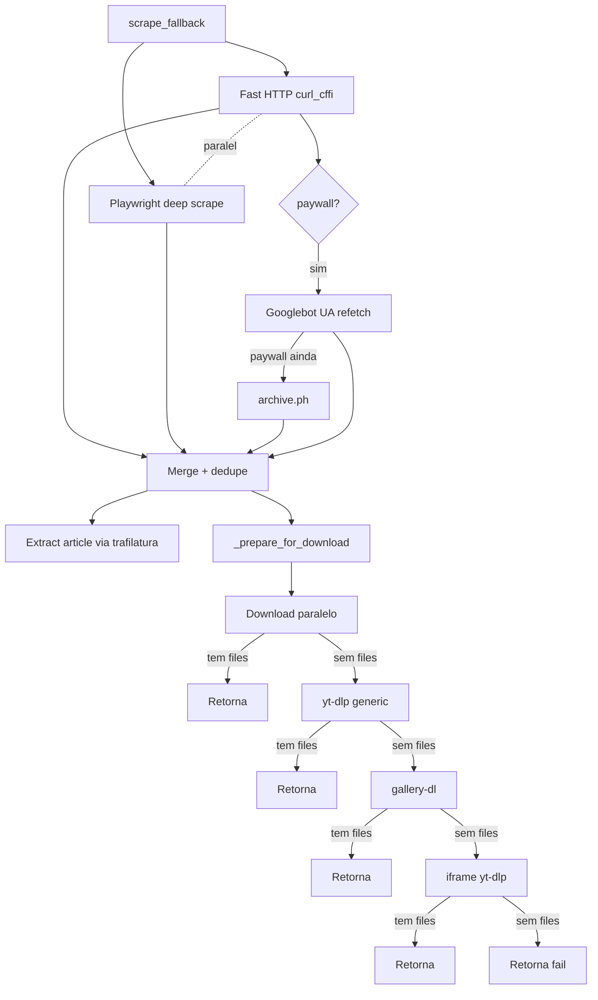

# Cascata do scraper genérico

Quando nenhum handler dedicado responde, `scrape_fallback(url, folder)` tenta extrair mídia da URL passando por **tiers ordenados por custo computacional**.

## Diagrama completo



## Tier 1 — Fast HTTP + Playwright em paralelo

`asyncio.gather` dispara duas coroutines:

### Fast HTTP (curl_cffi)

```python
r = curl_requests.get(url, impersonate="chrome", timeout=12)
```

Chrome impersonation engana 99% dos detectores básicos de bot. O HTML retornado é processado por:

- **`extract_meta_media`** — `og:image`, `og:video`, `twitter:image`, `twitter:player:stream`, etc.
- **`extract_jsonld_media`** — `<script type="application/ld+json">` com `VideoObject`, `ImageObject`, `NewsArticle`
- **`extract_player_configs`** — patterns de jwplayer/videojs (`{file: "..."}`, `hlsManifestUrl`)
- **`extract_iframes`** — `<iframe src="...">` com hosts conhecidos (YouTube, Vimeo, Streamable)

### Playwright deep scrape

Abre `page` no Chromium headless (com cookies do Firefox), navega:

- **Sniff de network**: handler em `page.on("response", ...)` captura URLs de `resource_type in ('image', 'media')` ou content-type `mpegurl`/`dash+xml`
- **Auto-scroll** pra disparar lazy-load (até `SCRAPE_SCROLL_MAX_ROUNDS` rounds, parando quando estabiliza)
- **DOM final** parseado pelos mesmos `extract_*` helpers

### Merge + dedupe

`merge_media_lists(*lists, cap=SCRAPE_MAX_MEDIA_URLS)` concatena os candidatos e dedupe por **asset ID**. Mesma imagem servida por dois CDNs em duas resoluções vira um único asset.

Dedupe key (em ordem de tentativa):

1. Hex hash de 16-64 chars no path: `/abc123def456789012345678.jpg` → `abc123def456789012345678`
2. Base62 ID de 11+ chars antes de extensão: `/AbCd_-123XY.mp4` → `AbCd_-123XY`
3. Fallback: path lowercase

### Filtro de junk

`is_junk_url(url)` rejeita:

- `data:` URIs
- Hosts de tracking conhecidos (`doubleclick.net`, `google-analytics.com`, `scorecardresearch.com`)
- Paths com `pixel.gif`, `pixel.png`, `tracking`, `analytics`, `gtag`, `/favicon.`, `/spacer.`

### Rewrite pra resolução máxima

CDNs conhecidas têm a URL reescrita:

| Host | Transformação |
|---|---|
| `pbs.twimg.com` | `name=large` → `name=orig` |
| `*.fbcdn.net`, `cdninstagram` | Remove `_s640x640_` size token |
| `*.pinimg.com` | `/236x/` → `/originals/` |
| `redd.it`, `redditmedia.com` | Remove params de preview |

## Tier 2 — yt-dlp generic

Se o tier 1 não baixou nada:

```python
opts = {
    'force_generic_extractor': True,
    'format': f'bestvideo[height<={YTDLP_MAX_HEIGHT}]+bestaudio/best',
    'merge_output_format': 'mp4',
}
```

yt-dlp tenta detectar `<video>` HTML5, HLS, DASH, ou players JS conhecidos.

## Tier 3 — gallery-dl

Se yt-dlp falhou e `_can_handle_with_gallery_dl(url)` retorna True:

```python
gdl_job.DownloadJob(url).run()
```

gallery-dl tem extractors pra centenas de sites de galeria. Bot lista os arquivos novos na pasta após o run.

Throttle: `_GALLERY_DL_LOCK` async serializa as chamadas (gallery-dl global config não é thread-safe).

## Tier 4 — iframes via yt-dlp

Se o HTML tinha iframes embedados (YouTube, Vimeo, Streamable, Dailymotion, Twitch), tenta yt-dlp generic em cada um. Para no primeiro sucesso.

## Tier 5 — Screenshot prompt

Se TUDO falhou e `SCRAPE_SCREENSHOT_FALLBACK=yes`, o handler oferece **screenshot da página**. Detalhes em [Posts de texto](text-only-posts.md) (mesmo mecanismo de prompt).

## Caso especial: Facebook image-only

`_drop_facebook_image_only(files, url)` descarta resultados image-only do FB. FB retorna chrome de UI (avatar, ícone) como og:image em muitos casos — sem heurística pra distinguir UI de conteúdo, melhor descartar.

Se o post FB é vídeo, passa normalmente.
