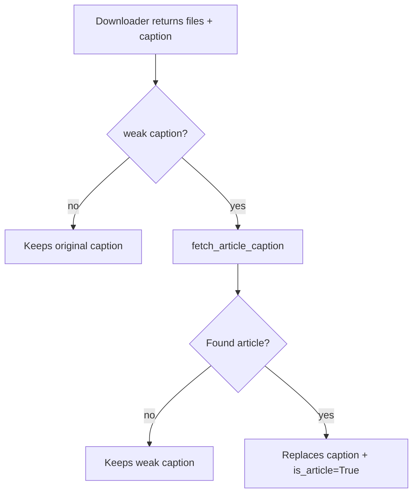

# Article extraction

When the scraper finds news/blog/article HTML, extracts the body via **trafilatura** and offers as send caption.

Trafilatura is the state-of-the-art lib for article extraction (same one used by Pocket, Instapaper, Firefox reader mode). Supports multi-language and auto-detects article vs listing/category page.

## When it fires

In **two paths**:

### 1. Inside `scrape_fallback`

When the generic scraper downloads HTML, automatically passes to `extract_article(html, url)`. If the result has >= `SCRAPE_ARTICLE_MIN_CHARS` (default 300), becomes the send caption.

### 2. Post-download enrichment

When any downloader (Threads, X, IG, etc.) returns without caption or with weak caption (just link), the dispatcher calls `fetch_article_caption(url)`:

1. Fetches with paywall bypass
2. Extracts article via trafilatura
3. If >= min_chars, uses as caption
4. Marks `is_article=True` so handler uses specific `ASK_ARTICLE_TIMEOUT/DEFAULT`



`_caption_is_weak(caption)` returns True when caption is empty or contains only the original link (no title nor body).

## Format

`extract_article` returns `(title, body)`. Bot builds the caption via `_build_caption({'title': title, 'description': body}, url)` — same format as other downloaders:

```
📄 Article title (in bold)

Article body here, multiple sentences, paragraphs...

🔗 Original Link
```

Auto-truncation to 1024 chars (Telegram limit) with "..." at the end.

## Prompt

By default, the bot **asks** if you want to include the article as caption:

```
📝 Description found!
Want to include as caption?

You have 5s to choose or I'll send it automatically.
```

**Difference vs normal caption:**

| Type | Default timeout | Default on timeout |
|---|---|---|
| Caption (Twitter/IG/etc.) | `ASK_CAPTION_TIMEOUT=5.0` | `ASK_CAPTION_DEFAULT=no` |
| Extracted article | `ASK_ARTICLE_TIMEOUT=5.0` | `ASK_ARTICLE_DEFAULT=yes` |

The motivation for default `yes` on article is that long news text is usually what the user wants to read — so sending by default makes more sense than discarding.

## Customization

| Key | Default | Description |
|---|---|---|
| `SCRAPE_ARTICLE_EXTRACT` | `"yes"` | Toggles the entire feature |
| `SCRAPE_ARTICLE_MIN_CHARS` | `300` | Min chars to consider article |
| `ASK_ARTICLE_TIMEOUT` | `5.0` | Time (s) to respond to prompt |
| `ASK_ARTICLE_DEFAULT` | `"yes"` | Behavior on timeout |

## False positives / negatives

**False positive**: trafilatura extracts something that isn't really an article (product list, FAQ, etc.) and offers as caption. User says "no" on the prompt — problem solved.

**False negative**: legitimate article but short (< 300 chars) is ignored. Lower `SCRAPE_ARTICLE_MIN_CHARS` to 100-150 if you want more aggressive.

## Logs

```
📰 Article detected (1850 chars body, 1024 chars caption) at https://nytimes.com/...
```

Shows extracted body size and final caption size post `_build_caption`.
