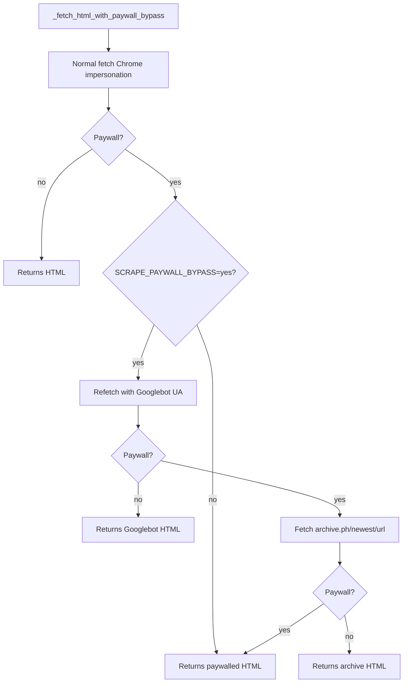

# Paywall bypass

"Soft" paywalls (NYT, Folha, FT, Estadão, WaPo, etc.) serve the full article to Googlebot for indexing. MediaRaven exploits this.

!!! warning "Soft vs Hard paywall"
    - **Soft** (covers via CSS/JS, content is in HTML): bypass works. ~70% of major newspapers.
    - **Hard** (paid Substack, Patreon, real login): content doesn't even leave the server. **No bypass possible.**

## The cascade



## Paywall detection

`_looks_like_paywall(html)` uses substring heuristic:

```python
_PAYWALL_PATTERNS = (
    'sign in to continue', 'log in to continue', 'subscribe to read',
    'create a free account to read', 'this content is for subscribers',
    'faça login para continuar', 'assine para ler',
    'conteúdo exclusivo para assinantes',
)
```

Not perfect — false negatives when paywall text is dynamic, false positives on pages that mention "subscribe to read" in another context. Cost of FN is the paywall passing through; cost of FP is unnecessary bypass attempt.

## Tier 1 — Googlebot UA refetch

If paywall detected, refetches with:

```python
User-Agent: Mozilla/5.0 (compatible; Googlebot/2.1; +http://www.google.com/bot.html)
```

Publishers serve full articles to Google for SEO indexing. If the server checks IP (rare), blocks. If only checks UA (common), passes.

Works on: NYT, Folha, Estadão, WaPo, FT, Bloomberg, WSJ (partial), Forbes, etc.

## Tier 2 — archive.ph fallback

If Googlebot still gets paywall:

```python
archive_url = f"https://archive.ph/newest/{quote(original_url)}"
```

archive.ph is a public archive that snapshots pages. Users have submitted most major newspapers in the last 10 years. `/newest/` returns the most recent version.

Limitation: only works if a snapshot exists. For just-published articles, may not have one.

## When bypass doesn't pass

Returns `(html_original, "normal")`. The scraper continues normal flow — `og:image` may still appear (paywall only blocks text). If it doesn't find media either, falls into Tier 4 (screenshot prompt).

## Combo: paywall bypass + article extraction

When bypass passes, the returned HTML has the full article. `extract_article` (trafilatura) extracts the body and offers as **send caption**. For text-only newspapers (no media), the user receives the full article as a Telegram message.

Details in [Article extraction](article-extraction.md).

## Customization

| Key | Default | Behavior |
|---|---|---|
| `SCRAPE_PAYWALL_BYPASS` | `"yes"` | `"no"` disables the entire cascade, respects original block |
| `SCRAPE_ARCHIVE_TIMEOUT_S` | `15` | archive.ph fetch timeout |

## Logs

```
🔒 Paywall detected at X — trying Googlebot UA.
✅ Googlebot UA bypassed paywall at X
📚 Trying archive.ph for: X
✅ archive.ph returned content for X
❌ Paywall not bypassed for X
```

Useful for debug: `LOG_LEVEL=DEBUG` also shows intermediate HTTP statuses.
