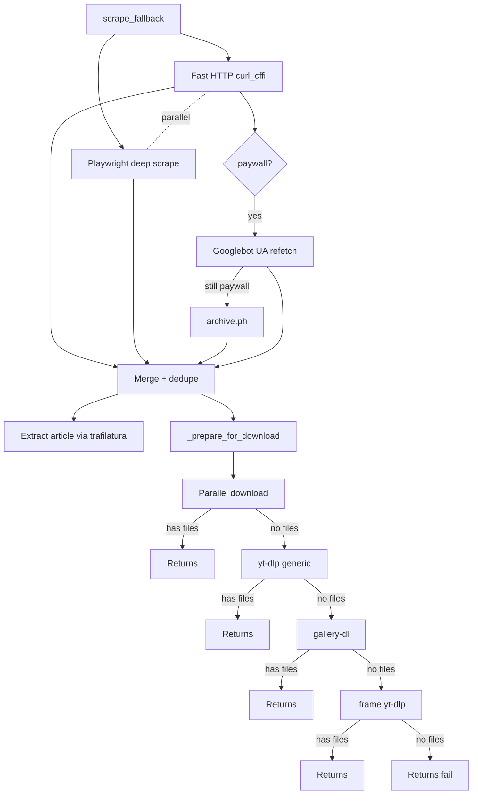

# Generic scraper cascade

When no dedicated handler responds, `scrape_fallback(url, folder)` tries to extract media from the URL by going through **tiers ordered by computational cost**.

## Full diagram



## Tier 1 — Fast HTTP + Playwright in parallel

`asyncio.gather` fires two coroutines:

### Fast HTTP (curl_cffi)

```python
r = curl_requests.get(url, impersonate="chrome", timeout=12)
```

Chrome impersonation fools 99% of basic bot detectors. The returned HTML is processed by:

- **`extract_meta_media`** — `og:image`, `og:video`, `twitter:image`, `twitter:player:stream`, etc.
- **`extract_jsonld_media`** — `<script type="application/ld+json">` with `VideoObject`, `ImageObject`, `NewsArticle`
- **`extract_player_configs`** — jwplayer/videojs patterns (`{file: "..."}`, `hlsManifestUrl`)
- **`extract_iframes`** — `<iframe src="...">` with known hosts (YouTube, Vimeo, Streamable)

### Playwright deep scrape

Opens `page` in headless Chromium (with Firefox cookies), navigates:

- **Network sniff**: handler in `page.on("response", ...)` captures URLs of `resource_type in ('image', 'media')` or content-type `mpegurl`/`dash+xml`
- **Auto-scroll** to trigger lazy-load (up to `SCRAPE_SCROLL_MAX_ROUNDS` rounds, stopping when stable)
- **Final DOM** parsed by the same `extract_*` helpers

### Merge + dedupe

`merge_media_lists(*lists, cap=SCRAPE_MAX_MEDIA_URLS)` concatenates candidates and dedupes by **asset ID**. Same image served by two CDNs in two resolutions becomes a single asset.

Dedupe key (in attempt order):

1. Hex hash of 16-64 chars in path: `/abc123def456789012345678.jpg` → `abc123def456789012345678`
2. Base62 ID of 11+ chars before extension: `/AbCd_-123XY.mp4` → `AbCd_-123XY`
3. Fallback: lowercase path

### Junk filter

`is_junk_url(url)` rejects:

- `data:` URIs
- Known tracking hosts (`doubleclick.net`, `google-analytics.com`, `scorecardresearch.com`)
- Paths with `pixel.gif`, `pixel.png`, `tracking`, `analytics`, `gtag`, `/favicon.`, `/spacer.`

### Rewrite to max resolution

Known CDNs have URL rewritten:

| Host | Transformation |
|---|---|
| `pbs.twimg.com` | `name=large` → `name=orig` |
| `*.fbcdn.net`, `cdninstagram` | Strips `_s640x640_` size token |
| `*.pinimg.com` | `/236x/` → `/originals/` |
| `redd.it`, `redditmedia.com` | Strips preview params |

## Tier 2 — yt-dlp generic

If tier 1 didn't download anything:

```python
opts = {
    'force_generic_extractor': True,
    'format': f'bestvideo[height<={YTDLP_MAX_HEIGHT}]+bestaudio/best',
    'merge_output_format': 'mp4',
}
```

yt-dlp tries to detect HTML5 `<video>`, HLS, DASH, or known JS players.

## Tier 3 — gallery-dl

If yt-dlp failed and `_can_handle_with_gallery_dl(url)` returns True:

```python
gdl_job.DownloadJob(url).run()
```

gallery-dl has extractors for hundreds of gallery sites. Bot lists new files in folder after the run.

Throttle: `_GALLERY_DL_LOCK` async serializes calls (gallery-dl global config isn't thread-safe).

## Tier 4 — iframes via yt-dlp

If the HTML had embedded iframes (YouTube, Vimeo, Streamable, Dailymotion, Twitch), tries yt-dlp generic on each. Stops at first success.

## Tier 5 — Screenshot prompt

If EVERYTHING failed and `SCRAPE_SCREENSHOT_FALLBACK=yes`, the handler offers **page screenshot**. Details in [Text-only posts](text-only-posts.md) (same prompt mechanism).

## Special case: Facebook image-only

`_drop_facebook_image_only(files, url)` discards image-only results from FB. FB returns UI chrome (avatar, icon) as og:image in many cases — without heuristic to distinguish UI from content, better discard.

If the FB post is video, passes normally.
