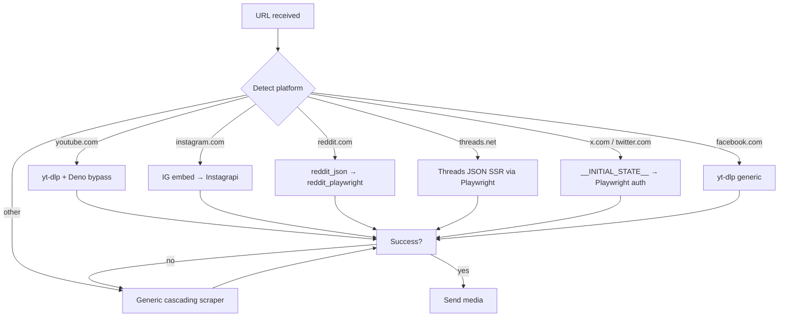

# Platforms

MediaRaven detects the platform from the URL domain and routes to a dedicated handler when one exists. When none does (or the dedicated one fails), falls into the [generic scraper](scraper.md).

## Routing

## When dedicated handler fails

Falls into the generic scraper, which tries:

1. **HTTP fast path** (curl_cffi with Chrome impersonation) + Playwright in parallel
2. **yt-dlp generic** (forced mode for any URL)
3. **gallery-dl** (Pinterest, Imgur, Tumblr, ArtStation, etc.)
4. **iframe yt-dlp generic** (embedded YouTube/Vimeo)
5. **Page screenshot** (last resort, opt-in prompt)

Details in [Scraper cascade](../architecture/scraper-cascade.md).

## Per-platform pages

- [YouTube](youtube.md) — videos, Shorts, multi-language dubbing
- [Instagram](instagram.md) — posts, reels, stories, carousels, photo+music
- [Reddit](reddit.md) — galleries, videos, NSFW, spoilers
- [Threads](threads.md) — posts, carousels, text-only
- [X / Twitter](x.md) — tweets with media, text-only
- [Facebook](facebook.md) — public videos
- [Generic scraper](scraper.md) — any other site
