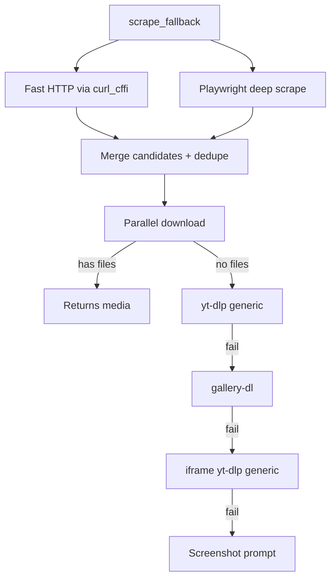

# Generic Scraper

When no dedicated handler responds (or all failed), the generic scraper attempts to extract media from **any URL** via cascading tiers, from cheapest to most expensive.

Covers everything: blogs, news sites, GitHub READMEs, Pinterest, Imgur, Tumblr, ArtStation, TikTok-mirror, and thousands of other sites.

## The cascade

Technical details in [Scraper cascade](../architecture/scraper-cascade.md).

## Tiers explained

### Tier 1 — Fast HTTP + Playwright in parallel

- **HTTP via curl_cffi** with Chrome impersonation gets `og:image`, `og:video`, `twitter:image`, JSON-LD, player configs
- **Playwright** sniffs all image/media requests + parses final DOM + iframes
- Results are **merged** and **deduped** by asset ID (same image in different CDNs becomes one)

They run in parallel via `asyncio.gather` — total latency = max(HTTP, Playwright), not sum.

### Tier 2 — yt-dlp generic

`force_generic_extractor=True` makes yt-dlp try any URL. Catches embedded HTML5 `<video>`, HLS, DASH, etc.

### Tier 3 — gallery-dl

Supports **dozens of gallery sites**: Pinterest, Imgur, Tumblr, ArtStation, DeviantArt, Furaffinity, e-hentai, etc. ([full list](https://github.com/mikf/gallery-dl/blob/master/docs/supportedsites.md))

Only fires if `_can_handle_with_gallery_dl(url)` returns True (gallery-dl identifies the site).

### Tier 4 — iframes

If the page has `<iframe>` with YouTube/Vimeo/Streamable/Dailymotion/Twitch, tries yt-dlp generic on each.

### Tier 5 — Screenshot fallback

If nothing worked and `SCRAPE_SCREENSHOT_FALLBACK=yes`, the bot **asks** the user if they want a page screenshot as alternative. Default on timeout: yes.

## Relevant configs

| Key | Default | What it does |
|---|---|---|
| `SCRAPE_MAX_PARALLEL_DOWNLOADS` | `6` | How many parallel downloads in tier 1. |
| `SCRAPE_MAX_MEDIA_URLS` | `60` | Candidate URL limit (protects against Pinterest with 1000 imgs). |
| `SCRAPE_SCROLL_MAX_ROUNDS` | `4` | Number of scrolls for lazy-load. |
| `SCRAPE_SCROLL_PAUSE_MS` | `3000` | Pause between scrolls. |
| `SCRAPE_MIN_IMAGE_SIZE` | `50` | Min (px) of post-download image (filters tracking pixels). |
| `SCRAPE_FAST_PATH_TIMEOUT_S` | `12` | curl_cffi timeout. |
| `SCRAPE_HLS_TIMEOUT_S` | `180` | ffmpeg timeout muxing HLS/DASH. |
| `SCRAPE_GALLERY_DL_ENABLE` | `"yes"` | Toggle tier 3. |
| `SCRAPE_GALLERY_DL_TIMEOUT_S` | `90` | Per gallery-dl call timeout. |
| `SCRAPE_PAYWALL_BYPASS` | `"yes"` | Enables paywall bypass (Googlebot UA + archive.ph). |
| `SCRAPE_ARTICLE_EXTRACT` | `"yes"` | Extracts article body via trafilatura as caption. |
| `SCRAPE_ARTICLE_MIN_CHARS` | `300` | Min chars to consider article. |
| `SCRAPE_SCREENSHOT_FALLBACK` | `"yes"` | Offers screenshot when everything fails. |

## Heuristics

### Junk filter

`_JUNK_PATH_HINTS` rejects URLs with `pixel.gif`, `pixel.png`, `/spacer.`, `tracking`, `analytics`, `gtag`, `doubleclick`, `googletagmanager`, `/favicon.`. `_JUNK_HOST_HINTS` rejects `doubleclick.net`, `google-analytics.com`, `scorecardresearch.com`, etc.

### Asset ID dedupe

Same image served by `cdn1.example.com/abc123.jpg?w=100` and `cdn2.example.com/abc123.jpg?w=200` becomes **one asset** (regex extracts the `abc123` hex/base62 ID).

### Rewrite to max resolution

Known CDNs have URL rewritten:

- `pbs.twimg.com` → adds `name=orig`
- `*.fbcdn.net` / `cdninstagram` → strips `_s640x640_` size token
- `*.pinimg.com` → changes path to `/originals/`
- `redd.it` / `redditmedia.com` → strips preview params (`width`, `height`, `crop`, etc.)

## Paywall bypass

Detects paywall via heuristic (text "Sign in to continue", "Subscribe to read", etc.). If detected and `SCRAPE_PAYWALL_BYPASS=yes`:

1. Refetches with `User-Agent: Googlebot/2.1` (publishers serve full article to Google for indexing)
2. If still paywalled, fetches snapshot at `archive.ph/newest/<url>`
3. If still paywalled, gives up and returns original HTML

Details in [Paywall bypass](../architecture/paywall-bypass.md).

## Article extraction

If `SCRAPE_ARTICLE_EXTRACT=yes`, `trafilatura` is called on the HTML. If it extracts >= `SCRAPE_ARTICLE_MIN_CHARS` chars, becomes the **send caption** (passing through the "Description found" prompt). Details in [Article extraction](../architecture/article-extraction.md).

## When nothing finds media

Last resort: **screenshot prompt**. If user accepts (or on timeout, default yes), the bot opens the page in Playwright and takes a 1920×1080 screenshot of the fold.

If even that doesn't solve it, returns generic message "Couldn't download the media."
