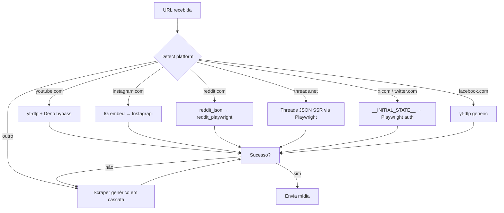

# Plataformas

O MediaRaven detecta a plataforma pelo domínio da URL e roteia pra um handler dedicado quando existe. Quando não existe (ou o handler dedicado falha), cai no [scraper genérico](scraper.md).

## Roteamento

## Quando handler dedicado falha

Cai no scraper genérico, que tenta:

1. **HTTP fast path** (curl_cffi com Chrome impersonation) + Playwright em paralelo
2. **yt-dlp generic** (modo forçado pra qualquer URL)
3. **gallery-dl** (Pinterest, Imgur, Tumblr, ArtStation, etc.)
4. **iframe yt-dlp generic** (YouTube/Vimeo embedados)
5. **Screenshot da página** (último recurso, prompt opt-in)

Detalhes em [Cascata do scraper](../architecture/scraper-cascade.md).

## Páginas por plataforma

- [YouTube](youtube.md) — vídeos, Shorts, dublagens multi-idioma
- [Instagram](instagram.md) — posts, reels, stories, carrosséis, foto+música
- [Reddit](reddit.md) — galerias, vídeos, NSFW, spoilers
- [Threads](threads.md) — posts, carrosséis, texto-only
- [X / Twitter](x.md) — tweets com mídia, texto-only
- [Facebook](facebook.md) — vídeos públicos
- [Scraper genérico](scraper.md) — qualquer outro site
