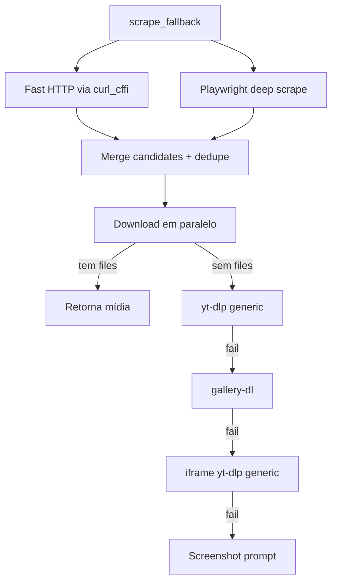

# Scraper Genérico

Quando nenhum handler dedicado responde (ou todos falharam), o scraper genérico tenta extrair mídia de **qualquer URL** via cascata de tiers, do mais barato pro mais caro.

Cobre tudo: blogs, sites de notícia, GitHub READMEs, Pinterest, Imgur, Tumblr, ArtStation, TikTok-mirror, e milhares de outros sites.

## A cascata

Detalhes técnicos em [Cascata do scraper](../architecture/scraper-cascade.md).

## Tiers explicados

### Tier 1 — Fast HTTP + Playwright em paralelo

- **HTTP via curl_cffi** com Chrome impersonation pega `og:image`, `og:video`, `twitter:image`, JSON-LD, player configs
- **Playwright** sniffa todas as requisições de imagem/mídia + parseia o DOM final + iframes
- Resultados são **mergeados** e **dedupeados** por asset ID (mesma imagem em CDNs diferentes vira uma só)

Se rodam em paralelo via `asyncio.gather` — latência total = max(HTTP, Playwright), não soma.

### Tier 2 — yt-dlp generic

`force_generic_extractor=True` faz o yt-dlp tentar qualquer URL. Pega vídeo embedado em `<video>` HTML5, HLS, DASH, etc.

### Tier 3 — gallery-dl

Suporta **dezenas de sites de galeria**: Pinterest, Imgur, Tumblr, ArtStation, DeviantArt, Furaffinity, e-hentai, etc. ([lista completa](https://github.com/mikf/gallery-dl/blob/master/docs/supportedsites.md))

Só dispara se `_can_handle_with_gallery_dl(url)` retorna True (gallery-dl identifica o site).

### Tier 4 — iframes

Se a página tem `<iframe>` com YouTube/Vimeo/Streamable/Dailymotion/Twitch, tenta yt-dlp generic em cada um.

### Tier 5 — Screenshot fallback

Se nada deu certo e `SCRAPE_SCREENSHOT_FALLBACK=yes`, o bot **pergunta** ao usuário se ele quer um screenshot da página como alternativa. Default no timeout: yes.

## Configurações relevantes

| Chave | Default | O que faz |
|---|---|---|
| `SCRAPE_MAX_PARALLEL_DOWNLOADS` | `6` | Quantos arquivos em paralelo no tier 1. |
| `SCRAPE_MAX_MEDIA_URLS` | `60` | Limite de candidatos (protege contra Pinterest com 1000 imgs). |
| `SCRAPE_SCROLL_MAX_ROUNDS` | `4` | Quantos scrolls pra carregar lazy-load. |
| `SCRAPE_SCROLL_PAUSE_MS` | `3000` | Pausa entre scrolls. |
| `SCRAPE_MIN_IMAGE_SIZE` | `50` | Mínimo (px) da imagem pós-download (filtra pixels de tracking). |
| `SCRAPE_FAST_PATH_TIMEOUT_S` | `12` | Timeout do curl_cffi. |
| `SCRAPE_HLS_TIMEOUT_S` | `180` | Timeout do ffmpeg ao mux'ar HLS/DASH. |
| `SCRAPE_GALLERY_DL_ENABLE` | `"yes"` | Liga/desliga o tier 3. |
| `SCRAPE_GALLERY_DL_TIMEOUT_S` | `90` | Timeout por chamada gallery-dl. |
| `SCRAPE_PAYWALL_BYPASS` | `"yes"` | Liga bypass de paywall (Googlebot UA + archive.ph). |
| `SCRAPE_ARTICLE_EXTRACT` | `"yes"` | Extrai corpo de artigo via trafilatura como caption. |
| `SCRAPE_ARTICLE_MIN_CHARS` | `300` | Mínimo de chars pra considerar artigo. |
| `SCRAPE_SCREENSHOT_FALLBACK` | `"yes"` | Oferece screenshot quando tudo falha. |

## Heurísticas

### Filtro de junk

`_JUNK_PATH_HINTS` rejeita URLs com `pixel.gif`, `pixel.png`, `/spacer.`, `tracking`, `analytics`, `gtag`, `doubleclick`, `googletagmanager`, `/favicon.`. `_JUNK_HOST_HINTS` rejeita `doubleclick.net`, `google-analytics.com`, `scorecardresearch.com`, etc.

### Dedupe por asset ID

Mesma imagem servida por `cdn1.example.com/abc123.jpg?w=100` e `cdn2.example.com/abc123.jpg?w=200` vira **um único asset** (regex extrai o `abc123` hex/base62 ID).

### Rewrite pra resolução máxima

CDNs conhecidas têm a URL reescrita:

- `pbs.twimg.com` → adiciona `name=orig`
- `*.fbcdn.net` / `cdninstagram` → remove `_s640x640_` size token
- `*.pinimg.com` → muda path pra `/originals/`
- `redd.it` / `redditmedia.com` → remove params de preview (`width`, `height`, `crop`, etc.)

## Bypass de paywall

Detecta paywall via heurística (texto "Sign in to continue", "Subscribe to read", etc.). Se detectado e `SCRAPE_PAYWALL_BYPASS=yes`:

1. Refetcha com `User-Agent: Googlebot/2.1` (publishers servem o artigo inteiro pra Google indexar)
2. Se ainda paywalled, busca snapshot em `archive.ph/newest/<url>`
3. Se ainda paywalled, desiste e retorna o HTML original

Detalhes em [Bypass de paywall](../architecture/paywall-bypass.md).

## Extração de artigo

Se `SCRAPE_ARTICLE_EXTRACT=yes`, o `trafilatura` é chamado no HTML. Se extrai >= `SCRAPE_ARTICLE_MIN_CHARS` chars, vira **caption do envio** (passando pelo prompt "Descrição encontrada"). Detalhes em [Extração de artigo](../architecture/article-extraction.md).

## Quando nada acha mídia

Última tentativa: **prompt de screenshot**. Se o user aceita (ou no timeout, default yes), o bot abre a página no Playwright e tira uma screenshot 1920×1080 da fold.

Se nem isso resolve, retorna mensagem genérica "Não foi possível baixar a mídia."
